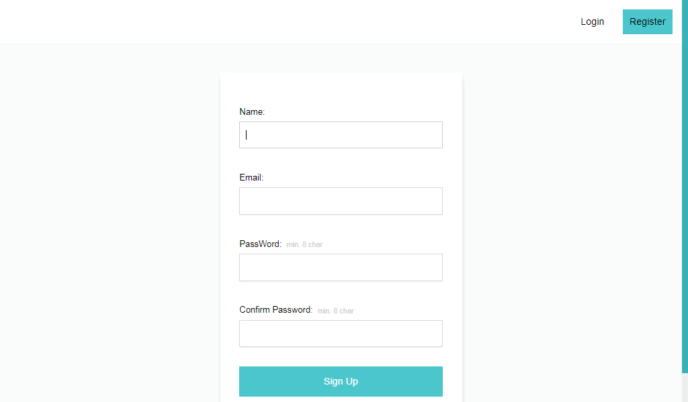
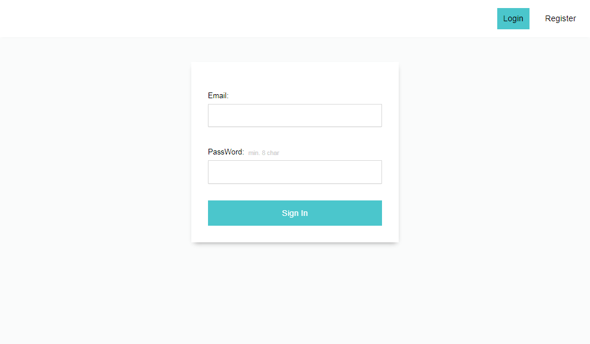
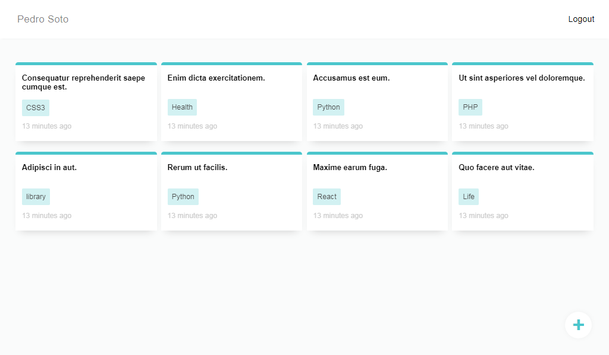
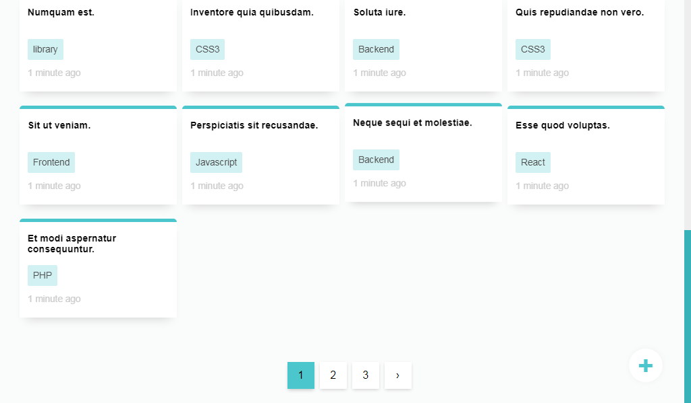
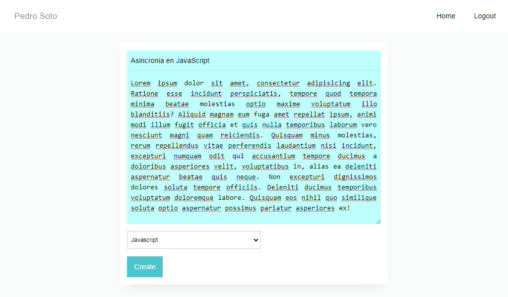
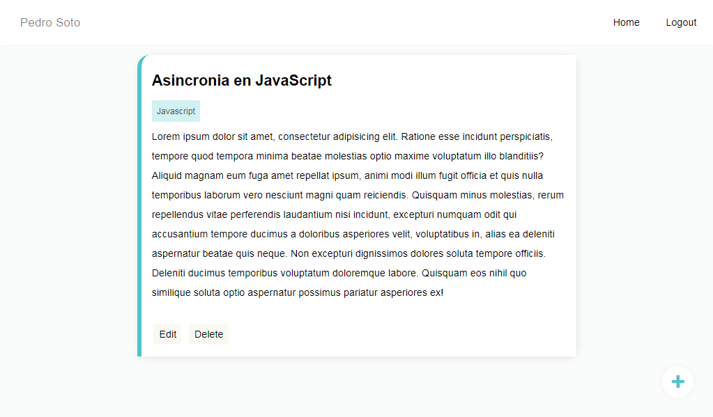

# SimpleNotes in Laravel

This is an application to create, edit and save fast notes.
## Features
- App Made in Laravel 8x
- Methodology FrontController (Model-View-Controller design pattern)
- Queries to DB with MySQL (ORM Eloquent)
- Use of sessions
- Authentication and user registration

## Screenshots

## How to use

**For Run This Project you need `php 7.3^|8^ and MySQL`**

1. Download the archive or clone the project using git
2. Enter to the folder
3. Open the console
4. Run the next command line `composer install`
5. Start MySQL services
6. Go to your database manager
7. Create a Database with the name `fast-notes`
8. Create one `.env` file
9. Configure the `.env` file, in acordance with `.env.example`
10. Set the key `DB_DATABASE` with the name of the database: `DB_DATABASE=fast-notes`
11. Run the migrations using the command `php artisan migrate`
12. Run in the console `php artisan db:seed --class=TagSeeder` to set the Tag table with the tags
13. Finally, start server using the command `php artisan serve`

